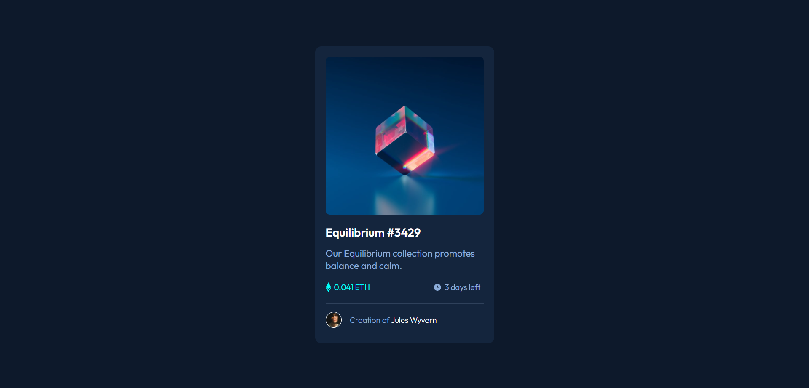

# Frontend Mentor - NFT preview card component solution

This is a solution to the [NFT preview card component challenge on Frontend Mentor](https://www.frontendmentor.io/challenges/nft-preview-card-component-SbdUL_w0U). Frontend Mentor challenges help you improve your coding skills by building realistic projects. 

## Table of contents

- [Overview](#overview)
  - [The challenge](#the-challenge)
  - [Screenshot](#screenshot)
  - [Links](#links)
- [My process](#my-process)
  - [Built with](#built-with)
  - [What I learned](#what-i-learned)
  - [Continued development](#continued-development)
  - [Useful resources](#useful-resources)
- [Author](#author)
- [Acknowledgments](#acknowledgments)

**Note: Delete this note and update the table of contents based on what sections you keep.**

## Overview

### The challenge

Users should be able to:

- View the optimal layout depending on their device's screen size
- See hover states for interactive elements

### Screenshot



### Links

- Solution URL: [Add solution URL here](https://your-solution-url.com)
- Live Site URL: [Add live site URL here](https://your-live-site-url.com)

## My process

### Built with
ONLY WITH
- Semantic HTML5 markup
- CSS custom properties

### What I learned
lernd how to do hover on image with another image
```css
.overlay{
    position: relative;
    
}
.imgequ{
    width: 100%;
    border-radius: 8px;
    display: block;
}
.icon{
    position: absolute;
    top: 0;
    background: hsla(178, 100%, 50%, 0.5);
    transition: 0.5s ;
    opacity:0;
    border-radius: 8px;
    padding: 42%;
    width: 16%;
}
.overlay:hover .icon{
    opacity: 1;
}
```

### Continued development
Why Not!
### Useful resources
I realy love this site
- [w3schools](https://www.w3schools.com/howto/howto_css_image_overlay_title.asp)

## Author

- Website - working on it
- Frontend Mentor - [@AmrEwais](https://www.frontendmentor.io/profile/AmrEwais)
